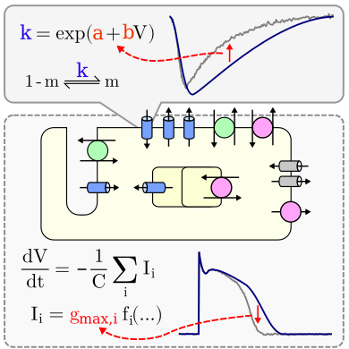

# Calibration of Ionic and Cellular Cardiac Electrophysiology Models

Dominic G. Whittaker, Michael Clerx, Chon Lok Lei, David J. Christini, Gary R. Mirams

Models of the cardiac action potential (center) are composed of several ion current submodels (top).
Both the submodels and the combined model require calibration to experimental data.
We discuss the classic and latest approaches to calibration in electrophysiology field, highlighting important concepts, common pitfalls, and open challenges.

This repository contains codes and source files necessary to reproduce examples and figures found in the paper.

## Figures

- [Graphical abstract](./fig0-abstract)
- [Overview figure](./fig1-overview)
- [Interpolation, Extrapolation & Overfitting](./fig2-overfitting-example)
- [Parameter identifiability](./fig3-parameter-identifiability-example)
- [Ion channel models](./fig4-ion-channel-models)
- [Four ways of fitting an ion channel model](./fig5-4-ways-of-fitting)
- [Evolution of model complexity](./fig6-evolution-model-complexity)
- [AP model calibration summary](./fig7-AP-model-calibration-summary)
- [Parameter transformation](./fig8-parameter-transformation-example)

## Acknowledging this work

If you publish any work based on the contents of this repository please cite:

[PLACEHOLDER]
