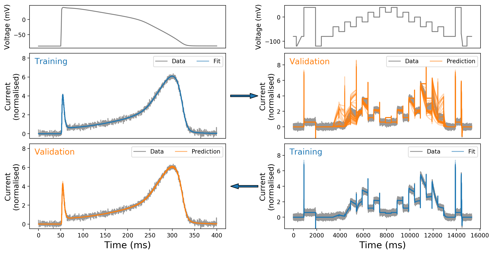

# Parameter identifiability example

This example demonstrates the consequences of unidentifiable parameters.

### Steps to reproduce the figure/example
1. Run fits using `herg-fit-ap.py` and `herg-fit-staircase.py` with argument `[int:fit_id]` for different random seeds and initial guesses.
2. Run `herg-rank-ap.py` and `herg-rank-staircase.py` to rank the obtained parameters in step 1.
3. Run `herg-predict.py` to plot and compare the predictions using different voltage protocol:

### Other files
#### Protocol files
- `ap-protocol.csv`
- `staircase-protocol.csv`
#### Model
- `herg.py`
