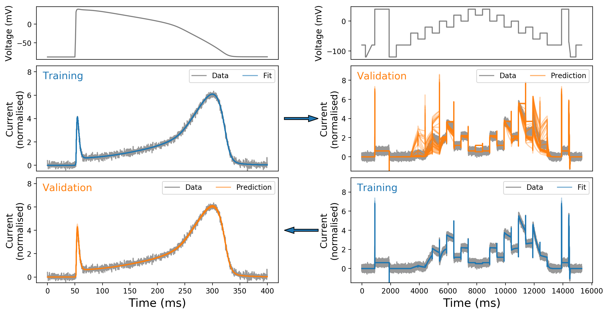

# Parameter identifiability example

This example demonstrates the consequences of unidentifiable parameters.

### Requirements
The code requires Python 2.7+ or 3.5+ and one dependency: [PINTS](https://github.com/pints-team/pints).

### Steps to reproduce the figure/example
1. Run fits using `herg-fit-ap.py` and `herg-fit-staircase.py` with argument `[int:fit_id]` for different random seeds and initial guesses.
All output are stored in [herg-out](./herg-out), for `fit_id` from 0 up to 89 are cached in this repo.
2. Run `herg-rank-ap.py` and `herg-rank-staircase.py` to rank the obtained parameters in step 1.
This creates `ap-fit-rank.txt` and `stair-fit-rank.txt` in [herg-out](./herg-out) to be used in step 3.
3. Run `herg-predict.py` to plot and compare the predictions from the best `N=45` fits with different voltage protocols.

### Other files
- `herg.py`: The ten Tusscher et al. (2004) [1] hERG model for PINTS [2].
- `ap-protocol.csv`: An action potential voltage protocol.
- `staircase-protocol.csv`: The staircase voltage protocol from <https://github.com/CardiacModelling/hERGRapidCharacterisation> [3].

### References
[1] Ten Tusscher, K. H. W. J., Noble, D., Noble, P. J., & Panfilov, A. V. (2004). A model for human ventricular tissue. American Journal of Physiology-Heart and Circulatory Physiology, 286(4), H1573-H1589.

[2] Clerx, M., Robinson, M., Lambert, B., Lei, C. L., Ghosh, S., Mirams, G. R., & Gavaghan, D. J. (2019). Probabilistic Inference on Noisy Time Series (PINTS). Journal of Open Research Software, 7(1), 23. DOI: http://doi.org/10.5334/jors.252

[3] Lei, C. L., Clerx, M., Gavaghan, D. J., Polonchuk, L., Mirams, G. R., Wang, K.
(2019).
[Rapid characterisation of hERG channel kinetics I: using an automated high-throughput system](https://doi.org/10.1016/j.bpj.2019.07.029).
_Biophysical Journal_, 117:(in press). DOI: https://doi.org/10.1016/j.bpj.2019.07.029
