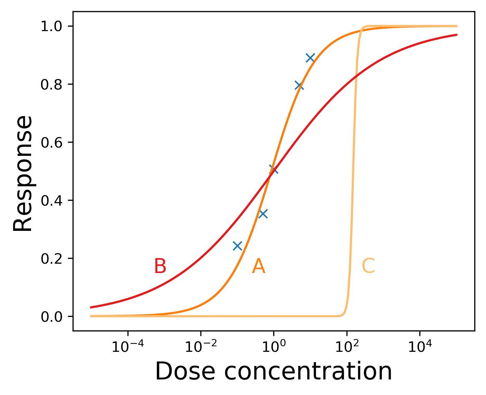

# Parameter transformation example

This example demonstrates the improvements in optimisation with parameter transforms.



### Requirements
The code requires Python 2.7+ or 3.5+.

### Steps to reproduce the figure/example
Simply run
```console
$ python hill-fit.py
```
